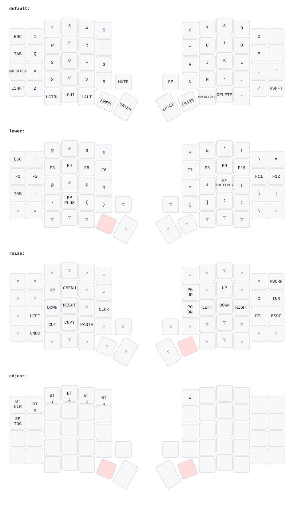

# PandaKB Sofle – ZMK firmware

- Keymap: `config/Sofle.keymap`
- Tùy chọn (sleep, OLED, BLE…): `config/Sofle.conf`
- Phần cứng (pin, OLED, encoder): `boards/shields/Sofle/`

Push lên GitHub → tab Actions → tải artifact → nạp `Sofle_left.uf2` / `Sofle_right.uf2`.

## Keymap

